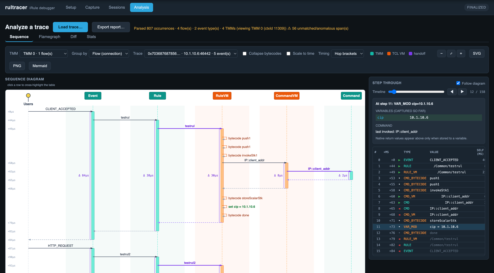
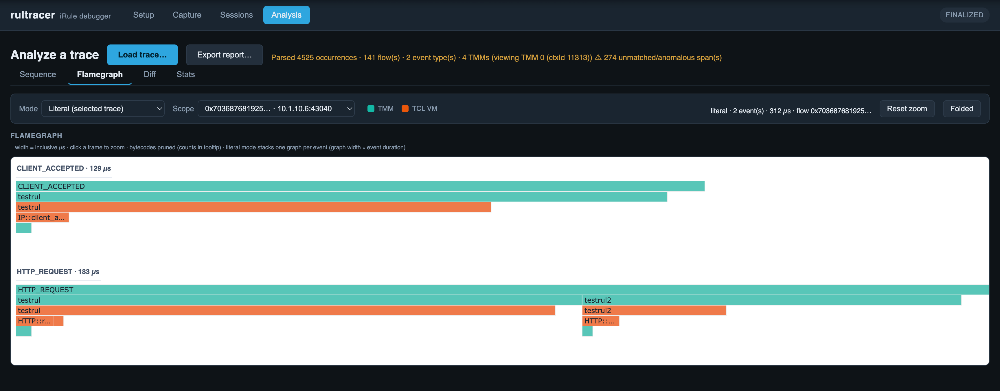
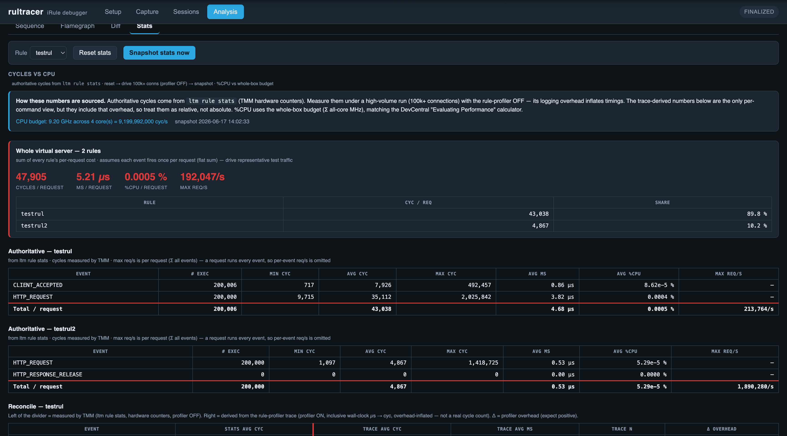

# rultracer

An F5 BIG-IP iControl LX / iApps LX extension that turns the tmsh-only
`ltm rule-profiler` iRule tracer into a visual debugger and profiler.

It runs **on the BIG-IP**: an on-box Node worker configures the profiler, captures
the trace stream to a per-session file, and serves it to a browser SPA that parses
and visualizes it — sequence diagram, step-through, flamegraph, cycle/CPU stats,
and exportable reports. See [docs/ARCHITECTURE.md](docs/ARCHITECTURE.md) for how
the pieces fit together and [PLAN.md](PLAN.md) for the full design and phased plan.

## Primary features

- **On-box capture.** Configure `ltm rule-profiler` against a virtual server,
  rules, and events from a browser; bounded capture (time- or count-limited) with
  automatic profiler/publisher setup and teardown. Captures persist as a session
  (CSV trace + manifest) you can re-open later, import, or export.
- **Sequence diagram + step-through.** A custom SVG sequence diagram across six
  lifelines (Users · Event · Rule · Rule VM · Command VM · Command) with TMM/TCL-VM
  domain coloring, paired with a linked step-through (table + timeline scrubber +
  variable/command replay). Cursor, table, and diagram stay cross-highlighted.
- **iRule source mapping.** Best-effort annotation of the iRule source: per-command
  HIT (µs + count), unfired (DIM) branches, and AMBIGUOUS multi-match commands.
- **Flamegraph + diff.** Interactive flamegraph (vendored d3 + d3-flame-graph, no
  build step) — aggregated (identical call paths merged) or a literal icicle, scoped
  whole-capture / per-event / per-flow, frames tinted by TMM/TCL-VM domain, width =
  inclusive µs, folded-stack export. A **Diff** view compares a second capture
  against the current one — differential (frames red/blue by self-time delta) or
  side-by-side.
- **Cycles vs CPU stats.** Turns the box's own `ltm rule stats` hardware cycle
  counters into the DevCentral "Evaluating Performance" tables — cycles → µs,
  %CPU/request (vs the whole-box budget), and max req/sec. A reconcile panel puts
  the authoritative cycles next to the trace-derived numbers (the gap = profiler
  overhead), plus a per-command trace table. A guided **Run Test** flow sequences a
  cycles run (profiler off) and a trace run as one session.
- **Reports.** Self-contained export of a capture as HTML (static icicle SVG),
  JSON, Mermaid sequence diagram, or Brendan-Gregg folded stacks.
- **Multi-TMM & trace layering.** Captures spanning multiple TMMs are partitioned
  by context id (TMM 0..N) with a scope selector and interleaved badges; stats stay
  whole-box, diff stays capture-vs-capture.

## Screenshots

> Live views from the browser SPA. (Images live in [`docs/images/`](docs/images/).)

**Sequence diagram + step-through**



**Flamegraph**



**Cycles / CPU stats**



## Layout

```
manifest.json         iControl LX package manifest
nodejs/               on-box workers (run in restnoded, Node 6.9.1 -> ES5)
  lib/                RestWorkers + shared helpers
presentation/         browser SPA (vanilla JS, no build step)
  js/                 pure logic seams + DOM/view modules
  css/                styles
  fixtures/           bundled example trace / iRule / multi-TMM CSV
  vendor/             vendored d3 (ISC) + d3-flame-graph (Apache-2.0); see vendor/LICENSES.md
build/                RPM build + install scripts
test/                 zero-dependency test harness (node test/unit.js + test/phase2..6.js)
docs/                 architecture, design docs, on-box runbooks, screenshots
background info/       source articles, man page, example captures (parser fixtures)
```

## Installing

rultracer installs over SSH with `build/install-onbox.sh`. You build the RPM on
your workstation, `scp` it to the BIG-IP, then run the installer **on the box as
root** — it provisions the persistent data directory, installs the package via the
iApps LX framework, runs the bundled `post-install.sh`, and verifies the workers
are up. Replace `<host>` and `<port>` below with your BIG-IP's SSH host and port
(drop `-P`/`-p` if it's reachable directly on port 22).

### First time on a new BIG-IP

`install-onbox.sh` is **not** part of the RPM, so copy it to the box once. Then
build, ship, and install the first RPM:

```bash
# 1. put the installer on the box (one time only)
scp -O -P <port> build/install-onbox.sh root@<host>:/shared/images/

# 2. build, ship, install
./build/build-rpm.sh 0.7.0 0001
scp -O -P <port> build/dist/rultracer-0.7.0-0001.noarch.rpm root@<host>:/shared/images/
ssh -p <port> root@<host> /shared/images/install-onbox.sh 0.7.0-0001
```

Because the installer runs as root, it creates `/shared/rultracer/data/sessions/`
owned by restnoded (`198:498`, mode 0750) **before** the workers start — the worker
process is uid 198 and can't create directories under `/shared/` itself. When it
finishes it prints the UI URL: `https://<host>/mgmt/shared/rultracer/ui/`.

### Subsequent iterations

The installer is already on the box, so just bump the release number, rebuild,
ship, and install:

```bash
./build/build-rpm.sh 0.7.0 0002
scp -O -P <port> build/dist/rultracer-0.7.0-0002.noarch.rpm root@<host>:/shared/images/
ssh -p <port> root@<host> /shared/images/install-onbox.sh 0.7.0-0002
```

This is an **in-place upgrade** that preserves saved sessions. Pass `--reinstall`
to force UNINSTALL+INSTALL instead (this **wipes** session data — use the Sessions
tab's "Download backup" first if you want to keep them).

> **Other install paths.** If you install via the F5 GUI or a raw
> `package-management-tasks` REST call, the data directory won't be provisioned —
> the iApps LX pipeline skips RPM `%post` scriptlets. The RPM bundles
> `post-install.sh` for exactly this case; run it once as root afterward:
> `ssh root@<host> bash /var/config/rest/iapps/rultracer/build/post-install.sh`
> (idempotent). A proxy-free, iControl-REST-only install flow is on the roadmap
> once it's validated on a clean box.

## Runtime constraints

- The restnoded worker process runs as **uid 198** (not root). On TMOS 21.x a
  direct `child_process.execFile('tmsh', …)` fails fatally — tmsh ignores `$HOME`
  and cannot write `/root/.tmsh-history-root`. So all **tmsh writes go through
  `POST /mgmt/tm/util/bash`** on the trusted `localhost:8100` channel, which runs
  the command as **root** and sidesteps the history-file problem (see
  `nodejs/lib/tmsh.js`). Object names are validated upstream so the single-quoted
  inner tmsh command can't be broken by user input.
- **Reads** use the GET-only iControl REST client (`nodejs/lib/iremote.js`) on
  `localhost:8100` — virtuals, rules, publishers, rule stats. Root-only log files
  (e.g. `/var/log/ltm`) are read via the same `util/bash` root channel.
- restnoded Node.js is **6.9.1**, so worker code is conservative ES5 (no arrow
  functions / template literals / `let`/`const`; `var` + Promises; decimal file
  modes).
- The browser SPA targets modern browsers and may use modern JS. Its pure logic
  seams (`parser`, `model`, `flame`, `cycles`, `reportdata`, `tmm`) are tested
  headless via `test/phase2..6.js`.
